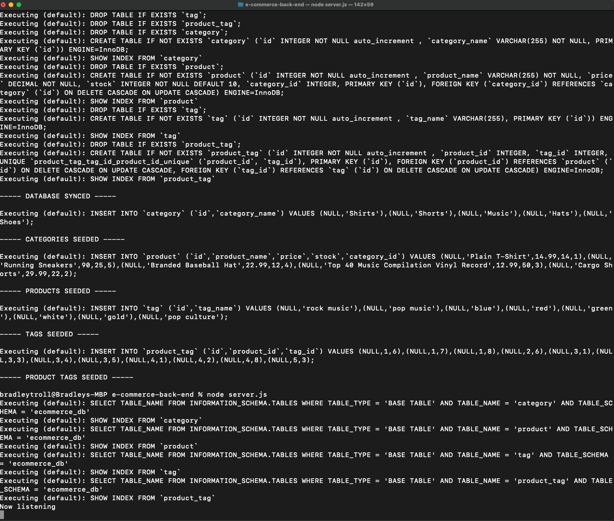
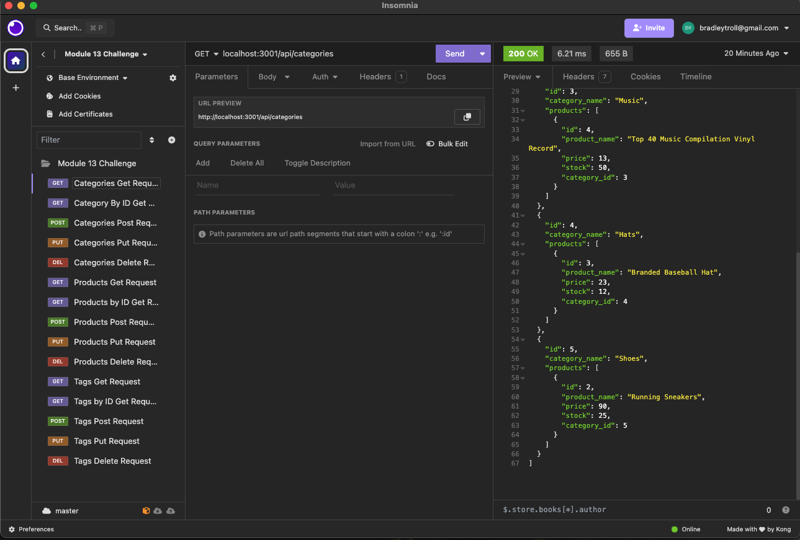
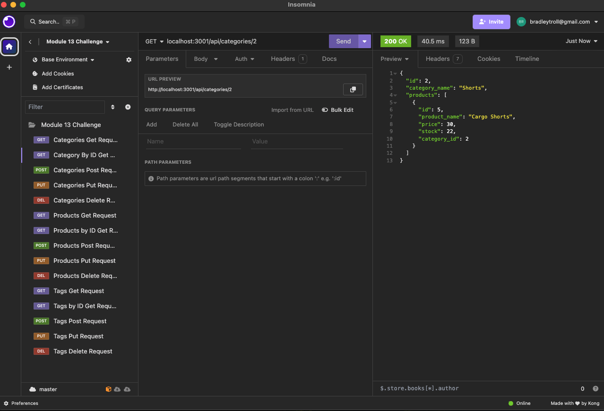
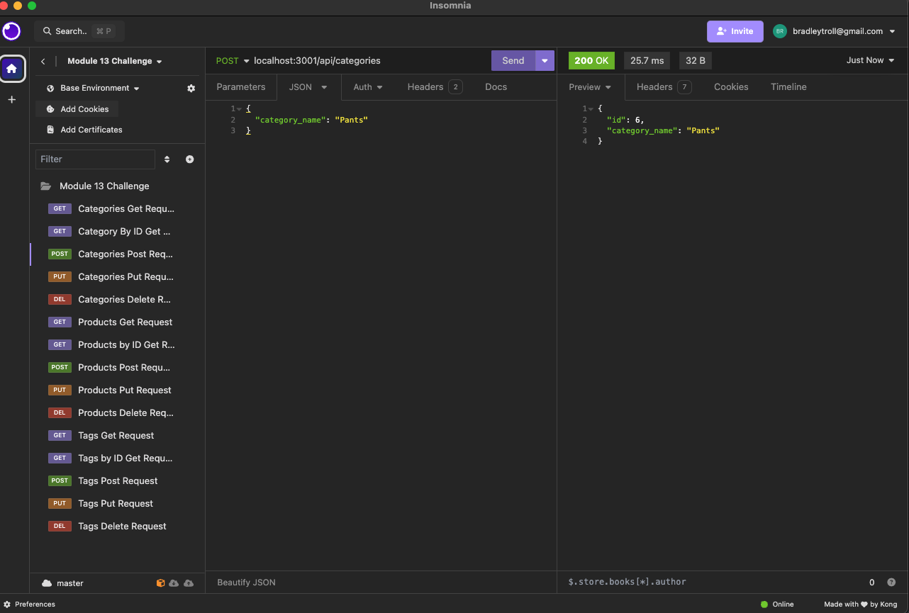
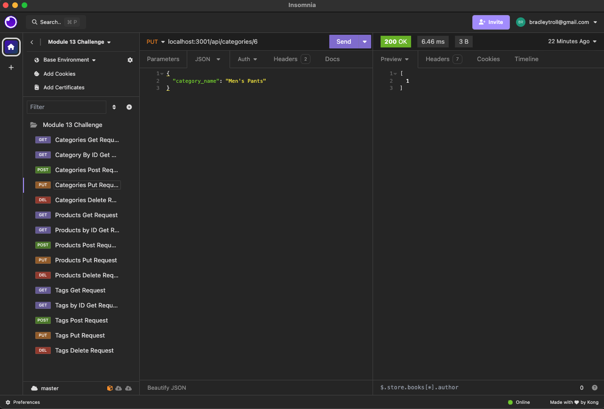
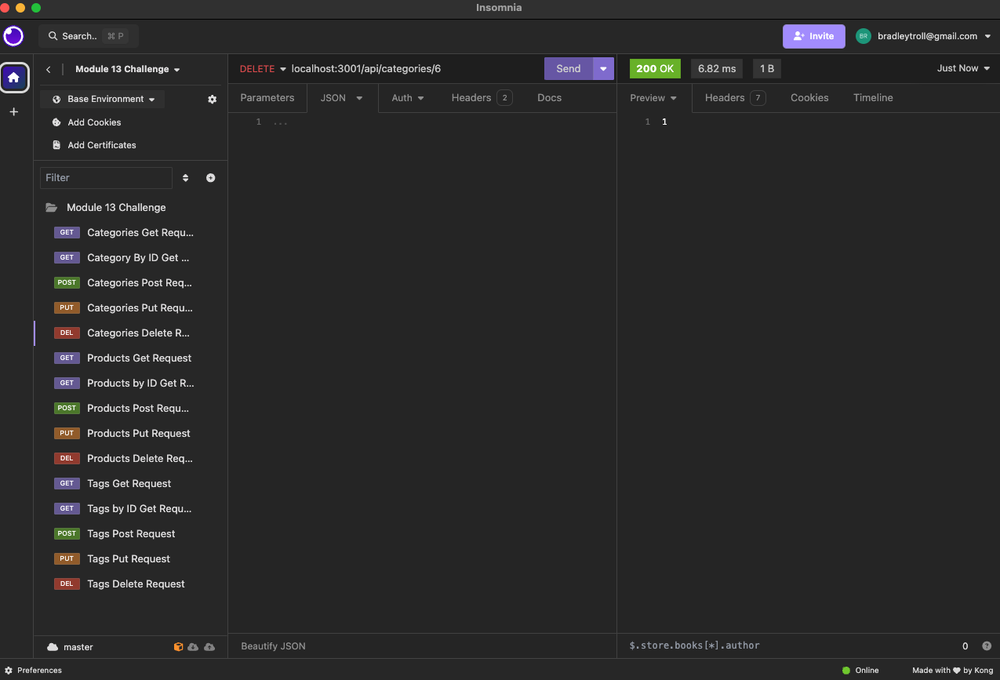

# E-Commerce Back End Product Database

## Table of Contents

- [Description](#description)
- [Installation](#installation)
- [Usage](#usage)
- [Credits](#credits)
- [How to Contribute](#how-to-contribute)
- [GitHub Repo](#github-repo)
- [Demonstration Video](#demonstration-vido)

## Description

This application serves as the back-end for an e-commerce site, using Sequelize to interact with a MySQL database. It provides API endpoints for managing product, category, and tag data, allowing for full CRUD operations on each resource. 

## Installation

Before installing, ensure you have Node.js and MySQL installed on your system. Follow these steps to set up Employee Tracker:

1. Clone the repository to your local machine using:

   ```md
   git clone https://github.com/bradleytroll/e-commerce-back-end.git
    ```

2. Navigate to the cloned directory and install the necessary dependencies with:
    ```md
    npm install
    ```
 
3. Seed the Database: 
     ```md
    npm run seed
    ```

4. Start the server:

    ```md
    node server.js
    ```

## Usage

Once the server is running, you can use Insomnia or a similar API testing tool to interact with the API endpoints. The application supports the following operations:

- View all categories, products, or tags
- View a single category, product, or tag by id
- Create a new category, product, or tag
- Update an existing category, product, or tag
- Delete a category, product, or tag








# Credits

This project utilizes the following technologies:

- [Node.js](https://nodejs.org/)
- [Express.js](https://expressjs.com/)
- [mysql12](https://www.npmjs.com/package/mysql2)


## How to Contribute

Contributions to improve Employee Tracker are welcome. Please adhere to the following guidelines:

- Open an issue to discuss your idea before making any significant changes.
- Fork the repository and create a new branch for your feature or fix.
- Write clean code with comments as necessary.
- Submit a pull request with a detailed description of your changes.

## GitHub Repo

For more information and to view the source code, visit the Employee Tracker GitHub repository: 

https://github.com/bradleytroll/e-commerce-back-end

## Demonstration Vido

To see the applicaiton in action, please follow the link below for a demonstration video:


https://drive.google.com/file/d/1mw8Cixert7St8cYjoBYTcVrojNYln7wr/view?usp=sharing

